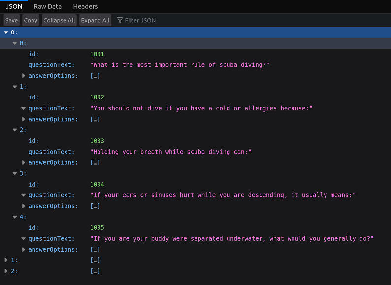
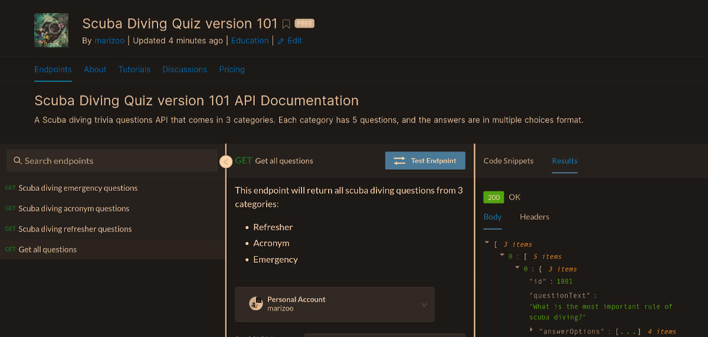

## DESCRIPTION:
A Scuba diving quiz API.

## OUTCOME:
- 100%: Make an API
- 100%: Publish it on Rapid API
- 0%: make a React quiz app, and fetch data from it.

## TECH STACKS:
- Javascript
-  NPM Dependencies :
    - "axios": "^0.21.4",
    -  "express": "^4.17.1",
    -  "nodemon": "^2.0.13"

## PROGRESS:
### Version 1.01.
    - Categories:
        - refresher.
        - acronym.
        - emergency.
    - Number of questions: 5.
    - Type of answers: Multiple Choices.

## How to run
- `yarn install`
- `yarn start` (will be on port 8000)
- Endpoints:
    - Welcome: `localhost:8000/`
    - All questions: `localhost:8000/trivia`
    - category: refresher; `localhost:8000/trivia/refresher`
    - category: acronym; `localhost:8000/trivia/acronym`
    - category: emergency; `localhost:8000/trivia/emergency`

## IMAGE:

